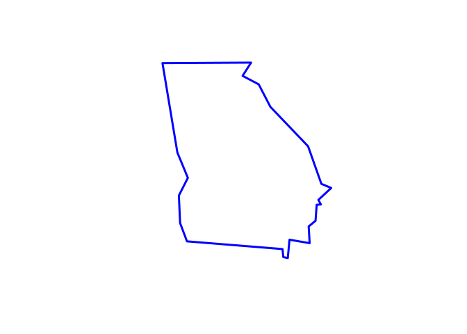
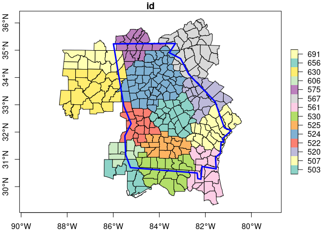

<!-- README.md is generated from README.Rmd. Please edit that file -->

# gchartsmap: Access ‘Google Charts’ Map Data

<!-- badges: start -->

[](https://github.com/odeleongt/gchartsmap/actions/workflows/R-CMD-check.yaml)
[](https://app.codecov.io/gh/odeleongt/gchartsmap)
<!-- badges: end -->

## Overview

This package connects to the ‘Google Charts’ geographic data resources,
allowing the user to download contents to use as a reference for related
services like ‘Google Trends’.

## Installation

Install the package from CRAN using:

``` r
install.packages("gchartsmap")
```

Install the development version from GitHub using:

``` r
remotes::install_github("odeleongt/gchartsmap")
```

## Usage

You will need Internet access to download data from the Google Charts
static content servers. There is some documentation for developers using
Google Charts at
<https://developers.google.com/chart/interactive/docs/gallery/geochart>,
but no information is provided on how to access the data directly.
Geographic information for regions at the sub-national level can be
accessed using the country codes listed in the Google Charts
documentation, with some suffix that is tracked in this package.

There is an additional level of data for the US that documents groups of
counties, and is used by services such as [Google
Trends](https://trends.google.com/trends/), but no documentation is
provided for this. Those files are accessed with an integer, and this
package attempts to grab each area by trying with numbers `1:1000` by
default.

``` r
library(package = "gchartsmap")
library(package = "sf")

# use the default, or set your own cache path
gchart_set_cache("your/preferred/cache/path")
```

    #> Linking to GEOS 3.8.0, GDAL 3.0.4, PROJ 6.3.1; sf_use_s2() is TRUE
    #> To install the cache path for use in future sessions, run this function with `install = TRUE`.

A cache is needed, as we want to avoid constantly fetching files from
the Google static servers.

``` r
# check out a list of all country codes
all_countries <- gchart_countries()
#> Getting updated country table.

# get data for the US
us <- gchart_generate_countries("US")
#> Reading cached country table.
#> Downloading country data... Done.
#> Processing geographic data... Done.

# check out some US areas
some_areas <- c(
  503L, 507L, 520L, 522L, 524L, 525L, 530L, 561L, 567L, 575L, 
  606L, 630L, 656L, 691L
)
areas <- gchart_generate_us_areas(some_areas)


# make a simple map of Georgia, US
plot( sf::st_geometry(us[us$id == "US-GA",]), lwd = 3, border = "blue")
```

<!-- -->

``` r

# draw the underlying areas
plot(areas[, "id"], axes = TRUE)
plot(sf::st_geometry(us[us$id == "US-GA",]), add = TRUE, lwd = 3, border = "blue")
```

<!-- -->

These geographic data are only intended for simple presentation. As
Google does not provide documentation on the coordinate reference
system, don’t expect the data to align to real world features without
processing that is out of the scope of this package. In the plot above,
you can notice some misalignment between the state border and the
smaller areas.
